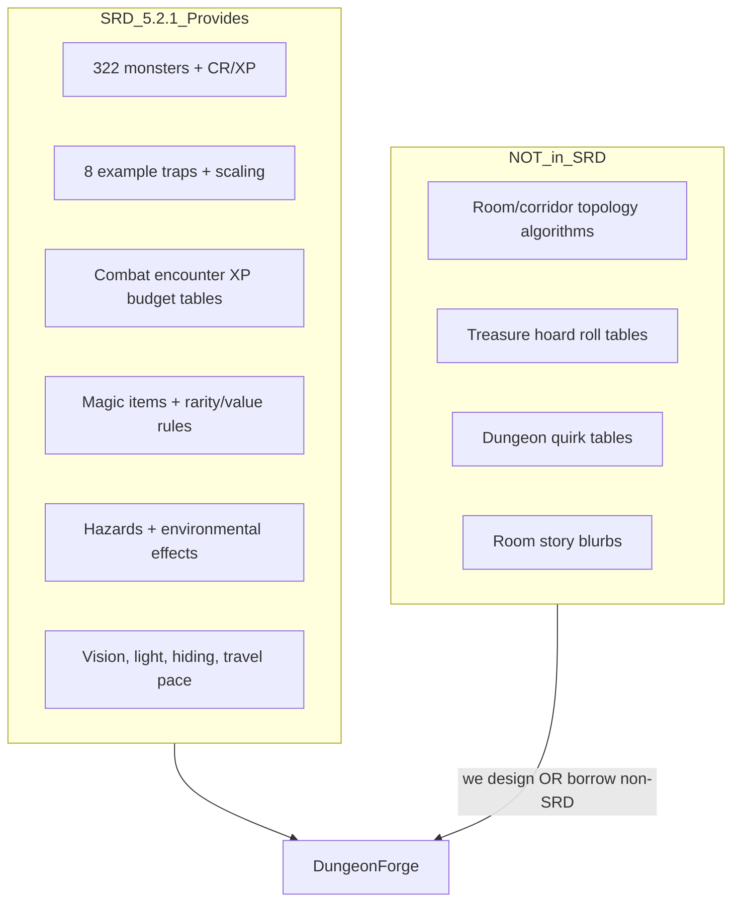
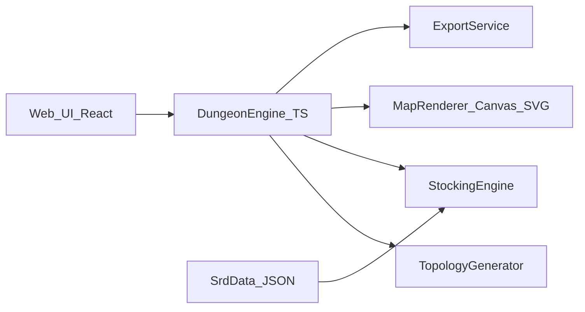

---
todos:
  - id: confirm-srd-scope
    status: completed
    content: User confirms SRD strictness (SRD-only vs custom tables vs DMG) and publishing intent
  - id: confirm-product-shape
    status: completed
    content: 'User picks v1 product: web generator vs CLI vs VTT vs platform'
  - id: confirm-generation-scope
    status: completed
    content: 'User selects v1 features: topology, encounters, traps, treasure, narrative, exports'
  - id: ingest-srd-data
    status: completed
    content: 'Add SRD 5.2.1 structured JSON (monsters, traps, magic items, XP tables) + CC attribution'
  - id: define-dungeon-schema
    status: completed
    content: 'Design DungeonDocument JSON schema (graph, rooms, contents, metadata)'
  - id: build-stocking-engine
    status: completed
    content: Implement SRD XP-budget encounters + level-scaled trap assignment
  - id: build-topology-generator
    status: completed
    content: Implement grid room/corridor generator with doors and configurable density
  - id: build-web-mvp
    status: completed
    content: Web UI + Markdown/JSON export for one-click dungeon generation
name: DungeonForge Grill Session
overview: 'A design discovery plan for DungeonForge — a SRD 5.2.1-grounded dungeon generator. The repo is greenfield; this plan maps what the SRD actually provides vs. what reference tools offer, surfaces every major feature decision, and proposes a phased build path pending your answers.'
isProject: false
---
# DungeonForge — Grill Session & Build Plan

## Current State

- Repo: [README.md](../../README.md) only (`"# DungeonForge"`), no code, no dependencies, no SRD data in workspace.
- Your SRD PDF (`SRD_CC_v5.2.1.pdf`) is **not in the workspace** — we will need to add it or ingest structured SRD data (e.g. [Open5e wotc-srd](https://open5e.com/), [cocoajamworld/srd-5.2.1](https://github.com/cocoajamworld/srd-5.2.1)) with CC-BY 4.0 attribution.
- Reference targets: [donjon](https://donjon.bin.sh/fantasy/dungeon/), [watabou One Page Dungeon](https://watabou.itch.io/one-page-dungeon), [watabou dungeon.html](https://watabou.github.io/dungeon.html), [tt-rpg.app](https://www.tt-rpg.app/en).

---

## Critical Insight: What SRD 5.2.1 Actually Gives Us

The SRD is **not a dungeon generator**. It is a CC-licensed rules corpus. There are **no procedural layout rules**, **no treasure hoard tables**, and **no dungeon quirk tables** in SRD 5.2.1.



### SRD content directly usable for stocking

| SRD Section | Use in generator |
|---|---|
| **Monsters A–Z** (~322 stat blocks) | Encounter composition, CR filtering |
| **Combat Encounters** (Gameplay Toolbox) | XP budget per level × difficulty × party size |
| **Traps** (8 examples) | Collapsing Roof, Falling Net, Fire-Casting Statue, Hidden Pit, Poisoned Darts, Poisoned Needle, Rolling Stone, Spiked Pit — each with level scaling |
| **Magic Items** | Loot by rarity; rarity→GP value table for pricing |
| **Environmental Effects / Hazards** | Room modifiers (extreme cold, deep water, suffocation, etc.) |
| **Poisons** | Trap/room hazards, locked chest complications |
| **Exploration** | Light levels, passive Perception for trap detection text |

### SRD gaps we must decide how to fill

- **Treasure hoards**: SRD has magic item rarity/values but **not** DMG-style "roll d100 for hoard composition" tables.
- **Dungeon theme/backstory**: No SRD quirk table — we invent motifs or skip.
- **Map topology**: Pure algorithm design (donjon/watabou inspired, not rules-derived).
- **NPC personalities**: Not in SRD — custom content if desired (tt-rpg style).

---

## Reference Site Feature Matrix

| Feature | donjon | watabou 1PD | tt-rpg | SRD-grounded? |
|---|---|---|---|---|
| Grid map (rooms/corridors) | Yes, highly parametric | Yes, organic/semi-symmetrical | AI image, not procedural grid | Algorithm, not SRD |
| Seeds / reproducibility | Yes | Yes | Yes | N/A |
| Motif/theme tags | 12 motifs | Tag system (winding, etc.) | Prompt-based | Custom |
| Door/trap/corridor styles | Yes | Limited | N/A | Traps from SRD |
| Room narrative blurbs | Minimal | **Core feature** | AI prose | Custom |
| Encounter/monster placement | No | Tags only | Tokens | **SRD XP rules** |
| Treasure generation | No | No | No | Partial (SRD items, no hoard tables) |
| Export PNG/SVG/PDF/JSON | Yes | Yes | VTT formats | Build choice |
| VTT walls/lights/fog | No | JSON for editors | **Core feature** | Build choice |
| Live session / initiative | No | No | Yes | Out of scope v1? |
| AI generation | No | No | Yes | Likely out of scope |

**Design fork:** Are we closer to **donjon** (parametric map factory), **watabou** (narrative one-page dungeon), or **tt-rpg** (session platform)? These imply very different architectures.

---

## Grill Session — Decisions Needed From You

Please reply with your choices (letter codes or free text). These block architecture.

### Block 1: Legal / Content Scope (most important)

**Q1. SRD strictness — pick one:**
- **A)** SRD-only: monsters, traps, magic items, encounter XP rules only; we invent treasure/layout/narrative algorithms
- **B)** SRD mechanics + original tables: same as A but we design CC-safe treasure/theme tables inspired by DMG structure (not copied text)
- **C)** SRD stat blocks + DMG tables for personal use (not publishable under CC)
- **D)** Help me decide

**Q2. Publishing intent:**
- **A)** Open-source CC-BY product (must stay SRD-clean)
- **B)** Private/homebrew tool only
- **C)** Commercial SaaS eventually

### Block 2: Product Shape

**Q3. Primary v1 deliverable:**
- **A)** Web generator (donjon/watabou UX)
- **B)** CLI + library (embeddable engine)
- **C)** VTT-first (Foundry Universal VTT export)
- **D)** Full platform (tt-rpg — maps + tokens + fog + initiative)

**Q4. Map style (core identity):**
- **A)** Donjon-style grid dungeon (configurable density, doors, dead-ends, stairs)
- **B)** Watabou-style organic layout + one-page key
- **C)** Both modes
- **D)** Content-first: minimal auto-map, focus on SRD encounter/trap/loot key

### Block 3: Generation Scope (check all for ideal v1)

- [ ] Map topology (rooms, corridors, doors, stairs, secret doors)
- [ ] Combat encounters (SRD XP budget: Low/Moderate/High)
- [ ] SRD traps with full stat text + detect/disarm notes
- [ ] Treasure (coins/gems/magic items — **needs custom hoard logic**)
- [ ] Room narrative blurbs / dungeon hook (One Page Dungeon style)
- [ ] Environmental modifiers (light, difficult terrain, SRD hazards)
- [ ] NPCs with dialogue (tt-rpg style — mostly custom, not SRD)

### Block 4: Input Parameters

**Q5. Required user inputs at generation time:**
- Party level (1–20)?
- Party size (default 4)?
- Encounter difficulty default (Low/Moderate/High)?
- Dungeon level/depth (number of floors)?
- Size (rooms count / grid dimensions)?
- Theme/motif (abandoned, undead, underdark, arcane, etc.)?
- Random seed?

**Q6. Should difficulty scale the whole dungeon or per-room?**
- Whole dungeon = one party level + average encounter difficulty
- Per-room = each room rolled independently (more swingy)

### Block 5: Output & Integration

**Q7. Export formats (priority order):**
- PNG/SVG map
- Markdown one-page dungeon key
- JSON (machine-readable dungeon model)
- PDF printable
- Foundry VTT (walls, doors, lights)
- Roll20

**Q8. Grid type:** None / Square 5ft / Hex

**Q9. Edit after generate?** Static one-shot vs. in-browser editor (move rooms, reroll encounter)

### Block 6: Narrative & Flavor

**Q10. Narrative depth:**
- **A)** None — pure mechanical key (room #, contents, DCs)
- **B)** Light — one sentence per room + dungeon name
- **C)** Rich — watabou-style blurbs, rumors, treasure history
- **D)** AI-generated prose (tt-rpg style — adds LLM dependency)

**Q11. Should motifs affect SRD content selection?** (e.g. "Undead" → filter monsters by type Undead; "Arcane" → more Fire-Casting Statue traps)

### Block 7: Tech Preferences

**Q12. Stack preference (or "recommend"):**
- TypeScript monorepo (web + shared engine) — best for browser + npm package
- Rust core + WASM for web — best performance for large dungeons
- Python — fastest prototyping, weaker web UX
- Godot — if game-first (some watabou users do this)

**Q13. SRD data ingestion:**
- **A)** Parse your PDF into structured JSON (one-time, you maintain)
- **B)** Pull from Open5e API at build time
- **C)** Vendor [srd-5.2.1](https://github.com/cocoajamworld/srd-5.2.1) JSON + extend with traps/items

---

## Proposed Architecture (pending your answers)

Default recommendation if you want a publishable, donjon+watabou-inspired v1:



### Core modules

1. **`SrdDatabase`** — typed JSON: monsters (name, CR, XP, type, size), traps (full text + level bands), magic items (rarity, value), encounter XP table
2. **`TopologyGenerator`** — pluggable strategies:
   - `GridGraphGenerator` (donjon-like: BSP or room placement + corridor carving)
   - `OrganicGenerator` (watabou-like: symmetry-biased growth) — phase 2
3. **`StockingEngine`** — SRD-grounded:
   - Assign room roles: empty, encounter, trap, treasure, special
   - Build encounters via XP budget algorithm (Gameplay Toolbox steps 1–3)
   - Pick traps scaled to party level band (1–4, 5–10, 11–16, 17–20)
   - Assign magic items by rarity budget (custom hoard algorithm using SRD rarity values)
4. **`DungeonDocument`** — canonical model: graph of nodes (rooms) + edges (corridors/doors) + content payloads
5. **`Renderers`** — Canvas/SVG for map; Markdown template for one-page key
6. **`Exporters`** — JSON schema first; PNG/SVG; Foundry UVTT later

### SRD encounter algorithm (concrete)

From SRD Combat Encounters — implement exactly:

```
budget = XP_Budget_Per_Character[partyLevel][difficulty] × partySize
while budget > 0:
  pick monster(s) from SRD where CR appropriate for party level
  deduct monster XP from budget
  enforce: max 2-3 stat blocks, avoid CR >> party level one-shots
```

Trap scaling: read "At Higher Levels" tables from each of the 8 SRD traps.

---

## Phased Delivery (recommended)

### Phase 0 — Foundation
- Add SRD 5.2.1 structured data + CC attribution file
- Define `DungeonDocument` JSON schema
- CLI: `dungeonforge generate --level 3 --seed 42 --output dungeon.json`

### Phase 1 — MVP (SRD stocking + simple map)
- Grid map: 10–30 rooms, corridors, doors, 1 entrance
- Per-room: encounter OR trap OR treasure OR empty (weighted)
- SRD XP-budget encounters + scaled traps
- Markdown + JSON export
- Basic web UI with seed + level + size sliders

### Phase 2 — Map polish
- Secret doors, stairs/multi-floor
- Donjon-style params: density, corridor style, remove dead-ends
- PNG/SVG export, printable PDF

### Phase 3 — Narrative layer
- One-page dungeon key (watabou-inspired blurbs)
- Motif system filtering SRD monster/trap pools
- Custom CC-safe treasure hoard tables by CR band

### Phase 4 — VTT & platform (if desired)
- Foundry UVTT export (walls, doors, lights)
- Optional: fog of war, token placement — only if tt-rpg-style platform is the goal

---

## Recommended Defaults (if you want to move fast)

If you don't have strong preferences yet, I'd suggest:

| Decision | Recommendation | Why |
|---|---|---|
| SRD scope | **A/B** (SRD-only + original treasure tables) | Publishable under CC |
| Product | **Web generator + JSON library** | Matches references, shareable |
| Map style | **Donjon-style grid first** | Well-understood algorithms, easier MVP |
| v1 scope | Topology + encounters + traps + light treasure + markdown export | Core DM prep value |
| Skip v1 | NPC dialogue, AI prose, live session tools | Not SRD, huge scope |
| Stack | **TypeScript** (Vite + React UI, shared `packages/engine`) | Fast iteration, good exports |
| SRD data | **Vendor structured JSON** + supplement traps/items from PDF | Avoid PDF parsing fragility |

---

## What I Need From You Next

Reply with:

1. **Q1–Q4** choices (SRD scope, product shape, map style)
2. **Q5** checked inputs you want exposed
3. **Q7** export format priorities (top 3)
4. **Q10** narrative depth
5. **Q12–Q13** stack/data preferences or "use recommendations"
6. Confirm whether to **add the SRD PDF to the repo** (or use Open5e/vendor JSON)

Once you answer, I'll refine this into an implementation spec with file structure, JSON schemas, and first sprint tasks.
