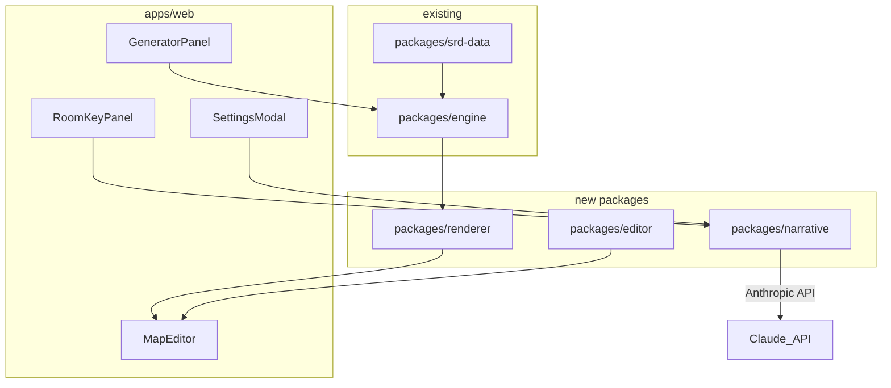

---
todos:
  - id: srd-pdf-attribution
    status: completed
    content: Add docs/srd/SRD_CC_v5.2.1.pdf + ATTRIBUTION.md; extend build-srd-data.py with hazards.json
  - id: schema-v2-types
    status: completed
    content: 'Extend GenerationOptions (all inputs + density sliders + mapTheme) and DungeonDocument schema v2 (floors, NPCs, hazards, narrative)'
  - id: engine-v2-features
    status: completed
    content: 'Multi-floor/stairs, configurable stocking weights, secret doors, hazards, NPC templates, rich narrative templates'
  - id: packages-renderer
    status: completed
    content: Create packages/renderer — 5ft SVG map with parchment and darkStone themes + PNG/SVG export
  - id: packages-editor
    status: completed
    content: 'Create packages/editor — Zustand state, pan/zoom, room select, reroll content, door toggle, undo/redo'
  - id: web-editor-shell
    status: completed
    content: Rework apps/web into 3-panel generator + editor + room key layout with export bar
  - id: anthropic-narrative
    status: completed
    content: 'packages/narrative with Anthropic provider, Settings modal (localStorage key), Enhance with AI buttons'
  - id: tests-docs-pr
    status: completed
    content: 'Unit tests, .env.example, README update, commit and update PR #1'
name: DungeonForge V2 Implementation
overview: 'Implement your approved spec on top of the existing MVP: add SRD PDF to repo, extend the generator with full configurable stocking and Block 3 features, build an in-browser SVG map editor with parchment/dark-stone themes and PNG/SVG export, and integrate Anthropic narrative via a secure client-side key flow (never committed to git).'
isProject: false
---
# DungeonForge V2 — Approved Implementation Plan

## Security notice (read first)

You pasted an **Anthropic API key in chat**. Treat it as **compromised** — rotate it at [console.anthropic.com](https://console.anthropic.com) before use.

**This key will never be committed to git.** Implementation will use:
- `.env.local` (gitignored) for local dev only
- In-app Settings storing key in **browser `localStorage`** (user-entered at runtime)
- Optional `VITE_ANTHROPIC_API_KEY` env var for dev — documented in `.env.example` with empty placeholder

The key you shared will **not** appear in code, plans, PRs, or logs.

---

## Your locked-in requirements

| Decision | Value |
|---|---|
| SRD scope | B — SRD mechanics + original CC-safe tables |
| Publishing | C — Commercial SaaS (Phase 4 deferred) |
| Product | Web generator + in-browser map editor |
| Map | Donjon-style 5ft square grid; configurable encounters/traps/loot |
| Scope | Full Block 3 (topology, encounters, traps, treasure, narrative, environment, NPCs) |
| Inputs | All: level, party size, difficulty, floors, room count, motif, seed |
| Difficulty | Whole dungeon |
| Output | PNG/SVG + live editor (not download-only) |
| Narrative | Rich templates + Anthropic AI (key via Settings) |
| Motifs | Filter SRD content |
| SRD data | Vendor JSON + PDF cross-check |
| Map theme | **Parchment** or **Dark stone** (user toggle) |

---

## Current baseline ([PR #1](https://github.com/jordanlarch/DungeonForge/pull/1))

Existing code to **keep and extend**:

- [`packages/engine/src/generator.ts`](../../packages/engine/src/generator.ts) — orchestration
- [`packages/engine/src/topology.ts`](../../packages/engine/src/topology.ts) — room placement + MST corridors
- [`packages/engine/src/stocking.ts`](../../packages/engine/src/stocking.ts) — XP-budget encounters, traps, treasure
- [`packages/srd-data/data/`](../../packages/srd-data/data/) — 322 monsters, traps, XP tables, motifs
- [`apps/web/src/App.tsx`](../../apps/web/src/App.tsx) — basic generate UI (to be replaced)

**Replace:** ASCII map tabs → SVG editor-first layout.

---

## Architecture



---

## Phase 1 — Foundation and data

### 1a. Add SRD PDF to repo

The PDF is **not in the workspace** yet (`c:\Users\Jordan\Downloads\...` is local to your machine).

On implementation:
1. Download official CC PDF from D&D Beyond (`SRD_CC_v5.2.pdf` / v5.2.1) into [`docs/srd/SRD_CC_v5.2.1.pdf`](../srd/SRD_CC_v5.2.1.pdf)
2. Add [`docs/srd/ATTRIBUTION.md`](../srd/ATTRIBUTION.md) with CC-BY 4.0 notice
3. If you prefer your exact local file, copy it to `docs/srd/` before the agent runs (or commit it yourself)

### 1b. Extend SRD data from PDF

Extend [`scripts/build-srd-data.py`](../../scripts/build-srd-data.py) to emit:
- [`packages/srd-data/data/hazards.json`](../../packages/srd-data/data/hazards.json) — environmental effects from SRD Gameplay Toolbox
- [`packages/srd-data/data/npc-templates.json`](../../packages/srd-data/data/npc-templates.json) — original CC-safe NPC personality/dialogue templates (motif-tagged)
- Validate traps + XP table against PDF section headings (smoke test script)

### 1c. Extend types and config

Expand [`packages/engine/src/types.ts`](../../packages/engine/src/types.ts):

```typescript
// New fields on GenerationOptions
floorCount: number;
encounterDensity: number;   // 0–100
trapDensity: number;
treasureDensity: number;
secretDoorChance: number;   // 0–1
hazardChance: number;
npcDensity: number;
mapTheme: "parchment" | "darkStone";
```

Extend `DungeonDocument` to schema v2:
- `floors: Floor[]` (each floor has rooms subset + stair links)
- `RoomContent.npc?: NpcContent`
- `RoomContent.hazard?: HazardContent`
- `RoomContent.narrative?: { template: string; aiEnhanced?: string }`

Bump [`packages/engine/schemas/dungeon-document-v1.json`](../../packages/engine/schemas/dungeon-document-v1.json) → `dungeon-document-v2.json`.

---

## Phase 2 — Engine upgrades

### 2a. Configurable stocking

Refactor [`packages/engine/src/stocking.ts`](../../packages/engine/src/stocking.ts):
- Replace fixed `ROLE_WEIGHTS` with density-driven weights from `encounterDensity`, `trapDensity`, `treasureDensity`
- Whole-dungeon difficulty unchanged (single XP budget per encounter room)
- Add `rerollRoomContent(roomId, options)` for editor use

### 2b. Multi-floor + stairs

Extend [`packages/engine/src/topology.ts`](../../packages/engine/src/topology.ts):
- Generate `floorCount` levels; each floor gets `roomCount / floorCount` rooms
- Add `StairEdge` connecting rooms across floors
- Entrance always on floor 1

### 2c. Secret doors and hazards

- Roll `secretDoorChance` on corridor `door` field → `"secret"`
- Assign SRD hazards to rooms via `hazardChance` + motif filter

### 2d. NPCs

New [`packages/engine/src/npcs.ts`](../../packages/engine/src/npcs.ts):
- Pick from `npc-templates.json` filtered by motif
- Attach personality, 2–3 dialogue lines, one secret per NPC room

### 2e. Rich narrative templates

New [`packages/narrative`](../../packages/narrative) package:
- Template blurbs per room role + motif (watabou-style one-liners + dungeon hook)
- `generateRoomNarrative(room, motif, rng)` — always available without AI

---

## Phase 3 — Renderer and map editor (primary UX)

### 3a. `packages/renderer`

SVG renderer from `DungeonDocument`:
- 5ft cell size (configurable pixels-per-foot, default 10px = 50px per cell)
- Layers: grid, rooms (filled rects), corridors, doors (symbols), room numbers, light icons
- **Themes:**
  - `parchment` — warm tan fill `#d4c4a8`, brown walls, serif labels
  - `darkStone` — charcoal `#2a2a2e`, slate walls, light gray labels
- Export helpers: `toSvgString()`, `toPngBlob()` via `html-to-image` or native SVG serialization

### 3b. `packages/editor`

Editor state (Zustand):
- `selectedRoomId`, `toolMode` (select / pan)
- `viewBox` (pan/zoom)
- `history` stack for undo/redo

Editor actions:
- Click room → select, show in sidebar
- **Reroll** encounter / trap / treasure for selected room
- Toggle door type on selected corridor
- Pan (drag) + zoom (wheel)

### 3c. Rework [`apps/web`](../../apps/web)

New layout:

```
┌─────────────┬──────────────────────┬─────────────┐
│  Generator  │   SVG Map Editor     │  Room Key   │
│  (inputs +  │   (pan/zoom/edit)    │  (selected  │
│   sliders)  │                      │   room +    │
│             │                      │   AI btn)   │
├─────────────┴──────────────────────┴─────────────┤
│  Export: PNG | SVG | JSON | Markdown  | Settings│
└─────────────────────────────────────────────────┘
```

Remove ASCII map tab. Editor is the default view after generate.

---

## Phase 4 — Anthropic AI narrative

New [`packages/narrative/src/anthropic-provider.ts`](../../packages/narrative/src/index.ts):

```typescript
interface NarrativeProvider {
  enhanceRoom(context: RoomNarrativeContext): Promise<string>;
  enhanceDungeon(context: DungeonNarrativeContext): Promise<string>;
}
```

- Model: `claude-sonnet-4-20250514` (or latest Sonnet)
- Prompt: motif + room role + mechanical contents → 2–3 sentence watabou-style blurb
- **Settings modal:** paste API key → `localStorage.setItem("df_anthropic_key", ...)`
- "Enhance with AI" button on room key + "Enhance all rooms" on toolbar
- Graceful fallback to templates if no key or API error
- Rate limit: sequential room enhancement with progress indicator

**SaaS note (Phase 5, not this PR):** move API calls to server proxy so keys never live in production client bundle.

---

## Phase 5 — SaaS foundation (deferred)

Not in this implementation pass:
- Auth (Clerk/Auth0)
- Cloud-saved dungeons
- Stripe billing
- Server-side AI proxy

Structure code so `NarrativeProvider` is injectable — local Anthropic now, server proxy later.

---

## File change summary

| Action | Path |
|---|---|
| Add | `docs/srd/SRD_CC_v5.2.1.pdf`, `docs/srd/ATTRIBUTION.md` |
| Add | `packages/renderer/`, `packages/editor/`, `packages/narrative/` |
| Add | `packages/srd-data/data/hazards.json`, `npc-templates.json` |
| Extend | `packages/engine/src/types.ts`, `topology.ts`, `stocking.ts`, `generator.ts` |
| Add | `packages/engine/src/npcs.ts`, `packages/engine/src/floors.ts` |
| Rework | `apps/web/src/App.tsx` → split into `GeneratorPanel`, `MapEditor`, `RoomKey`, `SettingsModal` |
| Add | `.env.example`, update `.gitignore` for `.env.local` |
| Update | `README.md`, bump schema to v2 |

---

## Testing strategy

- Engine unit tests: configurable stocking weights, multi-floor graph, secret door roll, NPC assignment
- Renderer snapshot tests: SVG output for both themes
- Narrative: mock Anthropic API in tests; never use real key in CI
- Manual: generate → edit → reroll room → export PNG/SVG round-trip

---

## Implementation order

1. PDF + extended SRD data + schema v2 types
2. Engine: configurable stocking, floors, secrets, hazards, NPCs, narrative templates
3. Renderer: SVG with parchment/dark-stone themes
4. Editor: pan/zoom, select, reroll, undo
5. Web shell: new 3-panel layout + export bar
6. Anthropic provider + Settings UI
7. Tests, README, update PR #1

Branch: continue on `cursor/dungeonforge-mvp-aaf1` or new `cursor/dungeonforge-v2-aaf1`.
