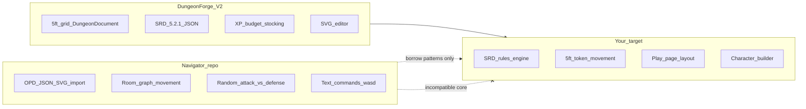
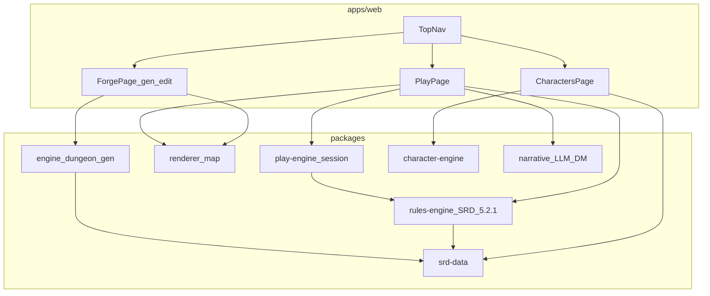
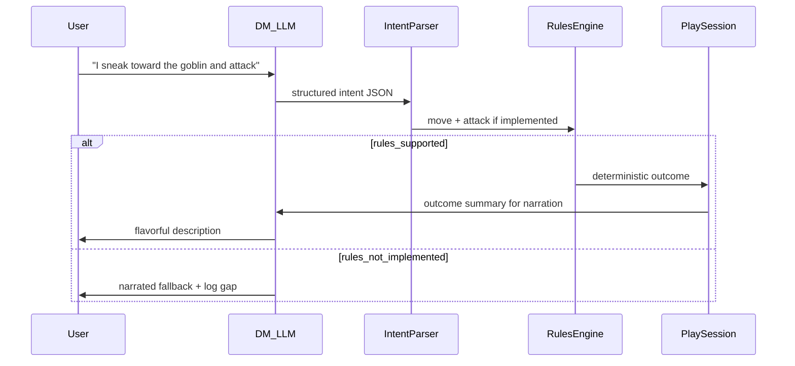

# DungeonForge Play Mode — Navigator vs Extend, Architecture Plan

## Executive recommendation

**Do not fork [one-page-dungeon-navigator](https://github.com/rendall/one-page-dungeon-navigator) as your base.**

**Do extend [DungeonForge](https://github.com/jordanlarch/DungeonForge) (`cursor/dungeonforge-mvp-aaf1`)** and selectively borrow **ideas and patterns** from the navigator.



---

## What one-page-dungeon-navigator actually is

| Aspect | Navigator implementation | Your requirement |
|--------|-------------------------|------------------|
| **Map model** | Watabou OPD `rects` + pre-bundled JSON/SVG pairs | Your [`DungeonDocument`](../../packages/engine/src/types.ts) 5ft grid with rooms/corridors |
| **Movement** | Room graph: `w/a/s/d` moves between **rooms**, not tiles | Drag-drop + arrow keys **1 cell (5ft)** on grid |
| **Combat** | No initiative; player acts → all enemies counterattack; `random()*attack` vs `random()*defense` | SRD initiative, turn order, Action/Bonus/Reaction, attacks, spells, conditions |
| **Characters** | Fixed 10 HP, ATK/DEF 1, flat inventory strings | Full character sheets, classes, levels, SRD stats |
| **Encounters** | Procedural spawn via [`lib/agentKeeper.ts`](https://github.com/rendall/one-page-dungeon-navigator/blob/master/lib/agentKeeper.ts) — **not** SRD XP budget | Already in [`packages/engine/src/stocking.ts`](../../packages/engine/src/stocking.ts) |
| **LLM** | None | DM chat for flavor + fallback for unbuilt rules |
| **UI** | Single-page text roguelike + decorative SVG | 3 routes: Forge / Characters / Play |
| **Tech** | Webpack + vanilla TS, no React | React monorepo (already started) |
| **Last updated** | April 2023, 1 star, abandoned patterns | Active your repo |

**Bottom line:** Navigator solves “play a cute roguelike on a watabou map.” You are building “SRD-accurate VTT-lite with generation, editing, and play.” ~80% of navigator’s `lib/` would be thrown away.

---

## What IS worth borrowing from navigator

These are **patterns**, not code to copy-paste:

| Pattern | Navigator source | Apply in DungeonForge |
|---------|------------------|----------------------|
| **Pure game loop** | `game(dungeon)(action) => GameOutput` in [`lib/gameLoop.ts`](https://github.com/rendall/one-page-dungeon-navigator/blob/master/lib/gameLoop.ts) | `packages/play-engine` — deterministic state machine, UI is thin client |
| **Immutable dungeon + mutable session** | `Dungeon` vs `GameState` split | `DungeonDocument` (static) + `PlaySession` (tokens, fog, combat) |
| **Fog of war on SVG** | Mask/reveal in [`src/index.ts`](https://github.com/rendall/one-page-dungeon-navigator/blob/master/src/index.ts) | Extend [`packages/renderer`](../../packages/renderer/src/index.ts) with explored/revealed cell layers |
| **Note → interactable** | [`lib/parseNote.ts`](https://github.com/rendall/one-page-dungeon-navigator/blob/master/lib/parseNote.ts) regex patterns | You already have structured `RoomContent` — better than regex on watabou notes |
| **CLI REPL for testing** | `scripts/node.ts` | `packages/play-engine` test harness without UI |
| **Pre-shipped dungeon list** | `static/dungeons/*.json` | Your saved `DungeonDocument` JSON library / user exports |

**Do not borrow:** `attackBy`, `enemiesAttack`, `parseDungeon` geometry, `agentKeeper` stat tables, room-graph exits.

---

## What DungeonForge already has (keep building on this)

On branch `cursor/dungeonforge-mvp-aaf1`:

- [`packages/engine`](../../packages/engine/) — topology, SRD XP stocking, schema v2, multi-floor
- [`packages/srd-data`](../../packages/srd-data/) — 322 monsters, traps, hazards, XP tables
- [`packages/renderer`](../../packages/renderer/) — SVG 5ft grid, parchment/darkStone
- [`packages/narrative`](../../packages/narrative/) — Anthropic provider (flavor)
- [`apps/web`](../../apps/web/src/App.tsx) — generator + basic editor (single page today)

You are ~30% toward “Forge page”; 0% toward Characters and Play pages.

---

## Target product architecture



### Three pages (your spec)

**1. Forge** (`/forge`) — evolve current [`App.tsx`](../../apps/web/src/App.tsx)
- Generate + edit dungeon (existing)
- Save/load `DungeonDocument` to localStorage or backend later
- Export PNG/SVG/JSON

**2. Characters** (`/characters`)
- SRD 5.2.1 character builder: species, class, level, ability scores, equipment from SRD
- Output: `CharacterDocument` JSON used by Play mode
- Party roster (size ties to encounter generation on Forge)

**3. Play** (`/play`) — new, largest effort
- Load dungeon + party
- Layout (top → bottom):
  - **Top nav** — site-wide
  - **Map viewport** — wheel zoom (prevent page scroll), pan, token drag or arrow-key nudge 5ft
  - **Action economy rail** — Action / Bonus / Reaction dropdowns → SRD options (Attack, Dash, Dodge, Help, Hide, Magic, Ready, Search, Study, Utilize…); turns red when spent
  - **Class features / spells / consumables** — toggles and dropdowns from character sheet
  - **LLM chat** — DM narration + intent parser; **must not** resolve mechanics when rules engine can
  - **Left rail** — character portrait; click opens full sheet (modal / “lighthouse” panel)

---

## Rules engine vs LLM — the split you described

This is the right architecture for SRD fidelity + your “LLM fills gaps” requirement:



**Deterministic engine owns:**
- Initiative (`d20 + DEX mod`, SRD order rules)
- Turn phases and action economy tracking
- Movement on 5ft grid (cost, difficult terrain, opportunity attacks when implemented)
- Attack rolls, damage, saving throws, conditions (incremental by priority)
- Encounter start from room `EncounterContent` using existing XP-budget monsters

**LLM owns:**
- Room/flavor narration
- Parsing free-text into `GameIntent` (`MoveIntent`, `AttackIntent`, `CastSpellIntent`, `TalkIntent`)
- Fallback adjudication when intent maps to `unsupported` capability flag
- DM personality — never silently overriding dice the engine rolled

**New package:** `packages/rules-engine` — pure TS, heavily unit-tested, no React.

---

## Grid movement (your spec vs navigator)

| Input | Implementation |
|-------|----------------|
| **Arrow keys** | Move active token ±1 cell if passable (corridor/room tile, door state, LOS optional later) |
| **Drag-drop** | Snap token to nearest valid cell on release |
| **LLM** | Parse to `{ type: "move", path: Cell[] }` or `{ type: "move", direction: "north", squares: 3 }`; engine validates |

Navigator’s WASD **cannot** be adapted — it moves between room IDs, not grid cells. Build fresh on `DungeonDocument.rooms[].tiles` + corridor points.

---

## Combat scope — realism check

Full SRD 5.2.1 combat is a **multi-year** rules engine (spells alone are hundreds). Phased approach:

### Play v1 (MVP) — recommended default: **solo, one PC**
- One character, monsters from dungeon encounters
- Initiative: full SRD order for PC + all monsters in room
- Action economy rail: Action + Bonus + Reaction (Movement as part of Action/Dash)
- Core actions: Attack (weapon), Dash, Dodge, Disengage, Hide, Help, Ready, Search, Study, Utilize
- Attack pipeline: d20 + mod vs AC, damage dice from SRD weapon/monster stat blocks
- Start combat when entering encounter room; end when all monsters dead or party flees
- LLM narrates; engine resolves all of the above

### Play v2
- Full party (2–6 PCs), turn UI for each, DM AI manages monster turns
- Spells (cantrips + level 1 first), concentration, saving throws
- Conditions (prone, poisoned, etc.) from SRD
- Traps from dungeon `TrapContent` with SRD detect/disarm DCs

### Play v3
- Multi-room persistence, long rest, XP award, level-up
- Reactions (opportunity attack, shield when implemented)
- LLM only for flavor + unimplemented edge cases (explicit capability registry)

**Default assumption:** solo v1, architect for party v2 (unless you say otherwise).

---

## Forge ↔ Play integration

When generating on Forge, you already pass party level/size/difficulty. Extend:

1. **`DungeonDocument.metadata`** — store `partySize`, `partyLevel`, `difficulty` (already partial)
2. **`EncounterContent`** — spawn tokens on room centroids at play start
3. **`PlaySession`** — references dungeon id + character ids + fog map + combat state
4. **Difficulty** — keep whole-dungeon SRD XP budget from [`getXpBudget`](../../packages/engine/src/srd-database.ts) (your existing rule)

---

## Comparison: three paths

| Path | Pros | Cons | Verdict |
|------|------|------|---------|
| **A. Fork navigator** | Play loop exists | Wrong map model, wrong combat, wrong UI stack, OPD-only import, rewrite 80% | **No** |
| **B. Start from zero** | Clean slate | Throws away SRD data, generator, editor, renderer you already built | **No** |
| **C. Extend DungeonForge** | SRD data + gen + editor done; same monorepo | Play + rules engine is greenfield | **Yes** |

---

## Proposed monorepo evolution

```
packages/
  engine/          # existing — dungeon generation
  renderer/        # existing — extend for tokens, fog, combat overlays
  srd-data/        # existing — extend with weapons, spells, conditions
  character-engine/  # NEW — SRD character creation + sheet model
  rules-engine/      # NEW — combat, movement, rolls, action economy
  play-engine/       # NEW — PlaySession, game loop, intent dispatch
  narrative/         # existing — extend with DM chat + intent parser
apps/web/
  src/pages/
    ForgePage.tsx
    CharactersPage.tsx
    PlayPage.tsx
  src/components/play/
    MapViewport.tsx      # wheel zoom, no page scroll
    ActionEconomyRail.tsx
    CharacterRail.tsx
    DmChat.tsx
```

Add **React Router** for three pages + shared top nav.

---

## Implementation phases

### Phase 1 — App shell + Forge split
- React Router: `/forge`, `/characters`, `/play`
- Move current generator UI to `ForgePage`
- `PlaySession` + `CharacterDocument` TypeScript schemas (no logic yet)

### Phase 2 — Character page v1
- SRD species/classes from `srd-data` (subset: Fighter, Wizard, Rogue + Human, Elf, Dwarf)
- Level 1–5, standard array/point buy
- Equipment from SRD adventuring gear + weapons
- Save party to localStorage

### Phase 3 — Play map + movement
- Token layer on SVG renderer
- Fog of war (explored cells)
- Arrow keys + drag-drop, 5ft snap
- LLM move intent → validated path

### Phase 4 — Combat v1 (solo)
- `rules-engine`: initiative, turns, action economy
- Action dropdowns with SRD-valid options
- Monster turns automated from SRD stat blocks
- DM chat narrates engine events

### Phase 5 — LLM intent bridge
- Structured output schema for DM parser
- Capability registry: `{ attack: true, spells: false, … }`
- Fallback narration for unsupported intents

### Phase 6 — Full party + spells (v2 scope)

---

## Risks and mitigations

| Risk | Mitigation |
|------|------------|
| Full SRD combat is huge | Capability registry + phased rules; LLM fallback only for `unsupported` |
| LLM invents dice results | Engine always rolls; LLM receives outcomes as facts |
| Navigator envy (fog, game loop) | Copy **architecture**, not code |
| Grid + room content mismatch | Tokens on tile graph derived from existing `RoomNode.tiles` |
| Watabou OPD import | Out of scope unless you add OPD JSON adapter later — different from your grid gen |

---

## Open decision (please confirm when executing)

**Play v1 party mode:** Plan assumes **solo (1 PC)** first, designed for full party in v2. Say if you want full party from day one (doubles combat UI complexity).

---

## Next step when you approve

1. Merge V2 branch to `main` (so local clone is current)
2. Phase 1: React Router + three-page shell + extract ForgePage
3. Phase 2–4 in order above

No navigator fork required.
